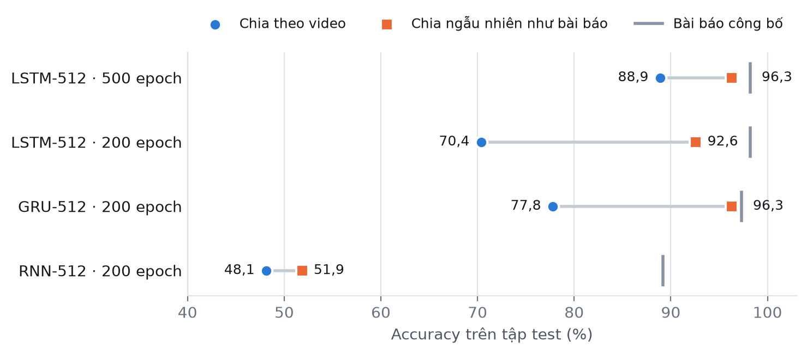
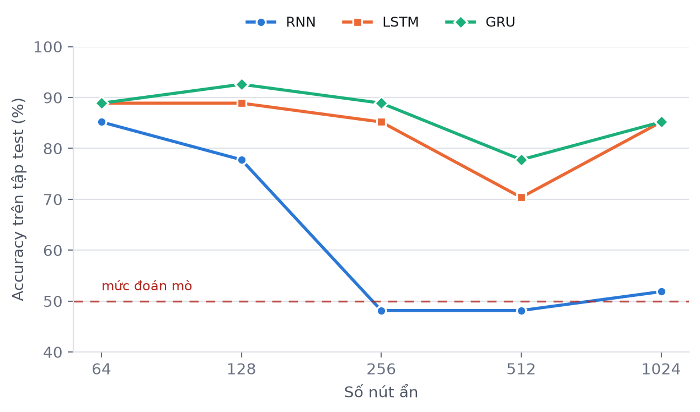
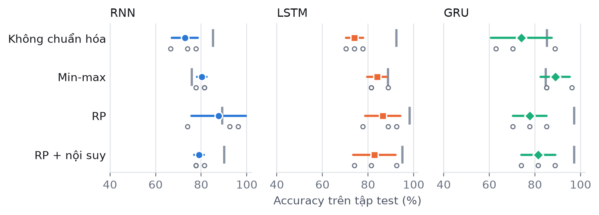
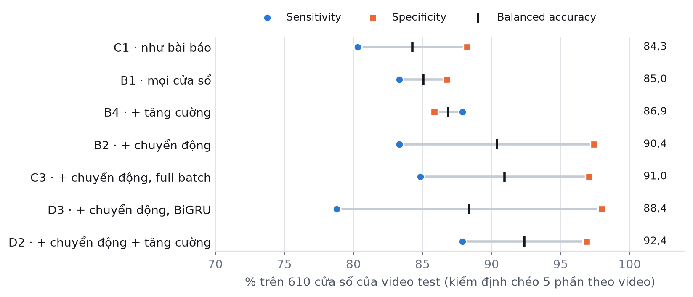
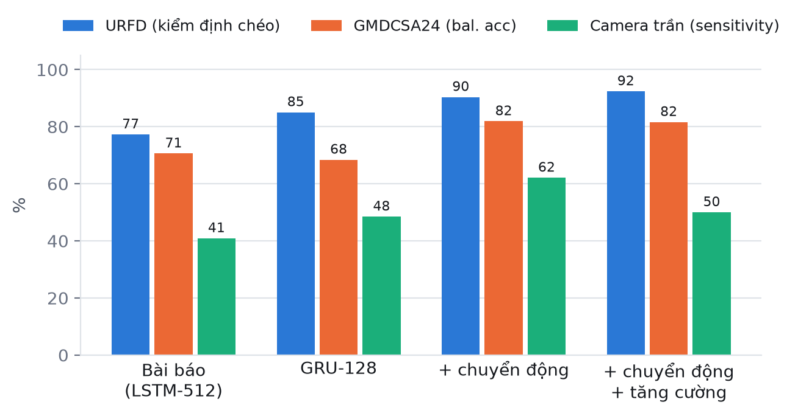

# Báo cáo kết quả: tái hiện Lin et al. 2021 trên URFD

**Bài báo tham khảo:** C.-B. Lin, Z. Dong, W.-K. Kuan, Y.-F. Huang, *A Framework for Fall Detection Based on
OpenPose Skeleton and LSTM/GRU Models*, Applied Sciences 11(1):329, 2021. DOI: 10.3390/app11010329.

> Mọi số liệu và hình trong file này được sinh bởi `python scripts/make_report.py` từ kết quả trong `runs/`.
> Chạy lại thí nghiệm rồi chạy lại script thì báo cáo cập nhật theo. Đơn vị là %; ô có dấu `*` là mô hình
> dự đoán mọi mẫu vào một lớp (không học được). Số trong ngoặc là giá trị bài báo công bố.

## 1. Tóm tắt

1. **Cách chia dữ liệu làm con số dao động mạnh trên một lần chia 27 mẫu.** Chia ngẫu nhiên theo cửa sổ như bài báo
   làm accuracy tăng 22,2 điểm (LSTM) và 18,5 điểm (GRU) trong một lần chia. Kiểm định chéo ở
   phần II (mục 8.2) cho thấy hiệu ứng thật nhỏ hơn: khoảng +5 điểm với cấu hình của bài báo, không rõ với GRU-128.
2. **Trên video chưa từng thấy**, cấu hình tốt nhất là GRU-128 với 92,6%
   (sensitivity 92,9%, specificity 92,3%). Cấu hình tốt nhất của bài báo
   (LSTM-512, lr 0,01) đạt 88,9% sau 500 epoch.
3. **Mô hình nhỏ ổn định hơn:** 64–128 nút ẩn cho kết quả tốt nhất; RNN từ 256 nút trở lên không học được.
4. **Chuẩn hóa có ích** (không chuẩn hóa ≈ 73,7%), nhưng **RP không vượt min-max một cách nhất quán**;
   các chênh lệch nằm trong một độ lệch chuẩn qua 3 lần chạy.

Phần II (mục 8–10) thêm kiểm định chéo theo video, đặc trưng chuyển động toàn thân, và kiểm tra tổng quát hóa sang
camera trần và bộ GMDCSA24; mục 10 đề xuất các hướng nghiên cứu mới. Mục 12 thu hẹp khác biệt dữ liệu với bài báo
(pose YOLO11m trên ảnh 640×480 gốc, thêm camera trần).

## 2. Thiết lập thí nghiệm

| Thành phần | Thiết lập | Bài báo |
|:---|:---|:---|
| Dữ liệu | URFD, camera 0: 30 video ngã, 40 video sinh hoạt, RGB 320×240, 30 fps | URFD + FDD, cả camera trần, 640×480 |
| Mẫu | Cửa sổ 100 khung, bước 10; cân bằng 66 `fall` + 66 `no_fall` | Nhóm 100 khung; 570 + 570 nhóm |
| Nhãn | Cửa sổ của video ngã là `fall` nếu có khung đang ngã hoặc đã nằm | Không mô tả chi tiết |
| Chia dữ liệu | 80/20 **theo video**: 105 train, 27 test (14 ngã, 13 không ngã) | 80/20 ngẫu nhiên theo nhóm |
| Pose | YOLO11n-pose (COCO-17) → 15 khớp; cổ, hông giữa = trung điểm | OpenPose BODY_25 → 15 khớp |
| Đầu vào | (x, y) của 15 khớp = 30 giá trị/khung, bỏ điểm tin cậy | Giống |
| Chuẩn hóa | RP: đổi về 640×480, dời hông giữa về tâm, **chia cho 640×480** | RP, giữ tọa độ pixel |
| Mô hình | 1 lớp RNN / LSTM / GRU + lớp kết nối đầy đủ, softmax 2 lớp | Giống |
| Huấn luyện | Adam, cross-entropy, full batch, **gradient clipping 1,0**, không validation | Adam, cross-entropy, full batch |
| Epoch | 500 cho cấu hình chính; 200 cho các thí nghiệm quét | 500 |

Mỗi mẫu sai trên tập test ≈ 3,7 điểm %.

## 3. Kết quả

### 3.1. Cấu hình của bài báo (512 nút, RP, lr 0,01, 500 epoch)

| Mô hình | Accuracy | Sensitivity | Specificity | Bỏ sót / báo nhầm | Bài báo (acc / sens / spec) |
| :--- | ---: | ---: | ---: | ---: | ---: |
| LSTM-512 | 88,9 | 85,7 | 92,3 | 2 / 1 | 98,2 / 100,0 / 96,4 |
| GRU-512 | 85,2 | 85,7 | 84,6 | 2 / 2 | 97,3 / 96,4 / 98,2 |
| RNN-512 | 48,1 | 0,0 | 100,0 | 14 / 0 | 89,2 / 93,7 / 84,8 |
| LSTM-512, chia ngẫu nhiên | 96,3 | 100,0 | 92,9 | 0 / 1 | 98,2 / 100,0 / 96,4 |

### 3.2. Ảnh hưởng của cách chia dữ liệu

Các cửa sổ 100 khung, bước 10, của cùng một video chồng lên nhau tới 90%. Khi chia ngẫu nhiên, gần như cùng một
cú ngã xuất hiện ở cả train lẫn test. Bảng dưới là từ một lần chia duy nhất (27 mẫu test) với mô hình 512 nút vốn học
không ổn định, nên phóng đại hiệu ứng; mục 8.2 đo lại bằng kiểm định chéo.

| Mô hình | Chia theo video | Chia ngẫu nhiên | Chênh | Bài báo |
| :--- | ---: | ---: | ---: | ---: |
| LSTM-512 · 500 epoch | 88,9 | 96,3 | +7,4 | 98,2 |
| LSTM-512 · 200 epoch | 70,4 | 92,6 | +22,2 | 98,2 |
| GRU-512 · 200 epoch | 77,8 | 96,3 | +18,5 | 97,3 |
| RNN-512 · 200 epoch | 48,1 | 51,9 | +3,7 | 89,2 |



*Hình 1. Accuracy trên tập test khi chia theo video (tròn) và chia ngẫu nhiên như bài báo (vuông); vạch xám là
giá trị bài báo công bố.*

### 3.3. Số nút ẩn (so với Bảng 5 của bài báo; 200 epoch, lr 0,01)

| Số nút ẩn | RNN | LSTM | GRU |
| :--- | ---: | ---: | ---: |
| 64 | 85,2 (82,6) | 88,9 (96,0) | 88,9 (93,0) |
| 128 | 77,8 (84,0) | 88,9 (96,0) | 92,6 (94,0) |
| 256 | 48,1* (86,3) | 85,2 (97,3) | 88,9 (96,0) |
| 512 | 48,1* (87,3) | 70,4 (98,3) | 77,8 (96,6) |
| 1024 | 51,9* (88,0) | 85,2 (94,6) | 85,2 (94,6) |



*Hình 2. Accuracy trên tập test theo số nút ẩn; đường đứt đoạn là mức đoán mò (≈ 50%).*

Với 512 nút và lr 0,01, độ chính xác trên tập train của LSTM dao động giữa 0,50 và 0,77 trong suốt quá trình học:
mô hình lớn cập nhật một lần mỗi epoch trên chỉ 105 mẫu thì không ổn định.

### 3.4. Learning rate (so với Bảng 6; 512 nút, RP, 200 epoch)

| Learning rate | RNN | LSTM | GRU |
| :--- | ---: | ---: | ---: |
| 0,1 | 48,1* (87,0) | 48,1* (97,0) | 77,8 (87,0) |
| 0,01 | 48,1* (87,3) | 70,4 (98,3) | 77,8 (97,0) |
| 0,001 | 51,9* (87,0) | 88,9 (96,6) | 81,5 (95,0) |

### 3.5. Cách chuẩn hóa (so với Bảng 8–10; 128 nút, lr 0,001, 200 epoch, 3 lần chạy)

Mỗi lần chạy dùng một seed khác nhau, tức một cách chia video và một khởi tạo khác. Giá trị là trung bình ± độ lệch
chuẩn.

| Chuẩn hóa | RNN | LSTM | GRU |
| :--- | ---: | ---: | ---: |
| Không chuẩn hóa | 72,8 ± 5,7 (85,2) | 74,1 ± 3,7 (92,4) | 74,1 ± 13,4 (85,2) |
| Min-max | 80,2 ± 2,1 (75,8) | 84,0 ± 4,3 (88,8) | 88,9 ± 6,4 (84,8) |
| RP | 87,7 ± 11,9 (89,2) | 86,4 ± 7,7 (98,2) | 77,8 ± 7,4 (97,3) |
| RP + nội suy | 79,0 ± 2,1 (90,1) | 82,7 ± 9,3 (95,0) | 81,5 ± 7,4 (97,3) |



*Hình 3. Trung bình ± 1 độ lệch chuẩn qua 3 lần chạy; vòng tròn nhỏ là từng lần chạy; vạch xám là bài báo.*

## 4. So sánh với bài báo

**Khớp:**
- LSTM và GRU tốt hơn hẳn RNN.
- Nội suy khớp thiếu không làm tăng độ chính xác (bài báo: 95% so với 98,2% khi không nội suy).
- Có chuẩn hóa tốt hơn không chuẩn hóa.
- Với cùng cách chia ngẫu nhiên, LSTM đạt 96,3%, sát 98,2% của bài báo.

**Không khớp:**
- Số nút ẩn: bài báo tốt nhất ở 512 nút; ở đây tốt nhất ở 64–128 nút.
- Learning rate: bài báo LSTM tốt nhất ở 0,01; ở đây ở 0,001.
- RP so với min-max: bài báo RP vượt rõ (LSTM 98,2% so với 88,8%); ở đây hai cách ngang nhau trong sai số.
- RNN: bài báo 87–90% ở mọi cấu hình; ở đây chỉ học được với 64–128 nút.

**Nguyên nhân có thể:**
1. Ít dữ liệu hơn nhiều (132 so với 1.140 mẫu): mô hình 512 nút với lr 0,01 học không ổn định. Đây là nguyên nhân
   lớn nhất: qua kiểm định chéo, cấu hình này chỉ đạt khoảng 77–83% trong khi GRU-128 đạt khoảng 88–91% (mục 8.2).
2. Rò rỉ dữ liệu khi chia ngẫu nhiên các cửa sổ chồng nhau: khoảng +5 điểm với cấu hình của bài báo.
3. Pose kém hơn: YOLO11n trên 320×240, tỉ lệ khớp thiếu 15,3% so với 12,5% của bài báo.
4. Tập test nhỏ: riêng việc đổi tập test làm kết quả lệch tới ±13,4 điểm.

## 5. Khác biệt triển khai so với bài báo

- **RP chia cho 640×480.** Với tọa độ pixel thô, loss đứng ở ln 2 và mô hình không học.
- **Gradient clipping 1,0.** Không có nó RNN phân kỳ trên chuỗi 100 khung.
- **Chia theo video** làm mặc định; cách chia ngẫu nhiên của bài báo được chạy riêng để so sánh.
- **Min-max** chỉ tính trên các khớp nhìn thấy (bài báo tính cả số 0 của khớp thiếu).
- **Chỉ URFD, chỉ camera 0:** camera trần chỉ có video ngã, dễ tạo lối tắt "góc trần = ngã".

## 6. Giới hạn

- Tập test 27 mẫu: chênh lệch dưới khoảng 7 điểm (2 mẫu) giữa hai cấu hình có thể chỉ là ngẫu nhiên.
- Thí nghiệm số nút ẩn và learning rate chạy một lần với một seed; chỉ phần chuẩn hóa được lặp lại 3 lần.
- Người đóng trong URFD là người trưởng thành, không phải người cao tuổi; bối cảnh là một căn phòng đủ sáng.
- Chưa có bộ FDD như bài báo.

## 7. Cách tái hiện

```bash
python -m falldet.urfd --out data/urfd
python -m falldet.extract_poses --videos data/urfd/videos --segments data/urfd/segments.csv \
    --out data/poses/urfd --weights yolo11n-pose.pt --resize-width 0
for m in lstm gru rnn; do python -m falldet.train --out runs/urfd/$m model.name=$m; done
python -m falldet.train --out runs/urfd/lstm_paper_split data.group_split=false
EPOCHS=200 bash scripts/lin2021_experiments.sh      # 39 thí nghiệm quét, runs/lin2021
bash scripts/normalization_seeds.sh                 # chuẩn hóa × 3 seed, runs/norm_seeds
python scripts/make_report.py                       # file này và docs/figures/
```

# Phần II: cải tiến và hướng nghiên cứu mới

## 8. Cải tiến vượt bài báo

### 8.1. Cách đánh giá

Mọi thí nghiệm ở phần này dùng **kiểm định chéo 5 phần theo video**: mỗi cửa sổ được test đúng một lần, rồi gộp kết
quả của 5 phần. 1 mẫu sai chỉ còn ≈ 0,8 điểm (132 cửa sổ) hoặc ≈ 0,2 điểm (610 cửa sổ),
so với 3,7 điểm ở phần I. Chỉ số chính là **balanced accuracy** = (sensitivity + specificity) / 2, so sánh được giữa
tập test cân bằng và tập test mất cân bằng. Cột "± SD" là độ lệch chuẩn accuracy giữa 5 phần.

### 8.2. Trên 132 cửa sổ cân bằng (thiết lập của bài báo)

Chia theo video:

| Run | Thay đổi | Balanced acc | Sensitivity | Specificity | Accuracy ± SD | Bỏ sót / báo nhầm |
| :--- | ---: | ---: | ---: | ---: | ---: | ---: |
| P1 | Cấu hình bài báo: LSTM-512, lr 0,01 | 77,3 | 74,2 | 80,3 | 77,3 ± 5,6 | 17 / 13 |
| A1 | GRU-128, lr 0,001 (mốc) | 90,9 | 86,4 | 95,5 | 90,9 ± 4,2 | 9 / 3 |
| A2 | A1 + đặc trưng chuyển động | 88,6 | 87,9 | 89,4 | 88,6 ± 10,8 | 8 / 7 |
| A3 | A2 + chọn checkpoint bằng validation | 85,6 | 80,3 | 90,9 | 85,6 ± 3,1 | 13 / 6 |
| A4 | LSTM-128 | 87,1 | 81,8 | 92,4 | 87,1 ± 6,8 | 12 / 5 |
| A5 | BiGRU-128 | 89,4 | 87,9 | 90,9 | 89,4 ± 7,1 | 8 / 6 |
| A6 | TCN | 87,1 | 77,3 | 97,0 | 87,1 ± 10,1 | 15 / 2 |

Chia theo cửa sổ, đúng cách đánh giá của bài báo (bài báo công bố 98,2%):

| Run | Thay đổi | Balanced acc | Sensitivity | Specificity | Accuracy ± SD | Bỏ sót / báo nhầm |
| :--- | ---: | ---: | ---: | ---: | ---: | ---: |
| P2 | Cấu hình bài báo | 82,6 | 86,4 | 78,8 | 82,6 ± 7,4 | 9 / 14 |
| E1 | GRU-128 | 87,9 | 92,4 | 83,3 | 87,9 ± 5,1 | 5 / 11 |
| E2 | GRU-128 + đặc trưng chuyển động | 89,4 | 92,4 | 86,4 | 89,4 ± 4,9 | 5 / 9 |

Với cùng dữ liệu pose, cấu hình của bài báo đạt 77,3% (theo video) và
82,6% (theo cửa sổ). GRU-128 đạt 90,9% theo video
và 87,9% theo cửa sổ (89,4% khi thêm đặc trưng chuyển động), **vượt cấu hình của bài báo trên cùng dữ liệu và cùng
cách đánh giá**. Con số 98,2% của bài báo không đạt được với dữ liệu ở đây ở cả hai cách đánh giá (xem mục 4 về các
nguyên nhân). Trên 132 cửa sổ, các thay đổi khác (đặc trưng chuyển động, chọn checkpoint, mô hình khác) không giúp:
dữ liệu quá ít.

### 8.3. Trên mọi cửa sổ: tập test thực tế

Cân bằng dữ liệu như bài báo bỏ đi phần lớn cửa sổ không ngã, trong đó có các cảnh khó (nằm lên giường, cúi người).
Ở đây mọi mô hình được test trên **cùng 610 cửa sổ** (66 ngã, 544 không ngã) của video test, cùng cách chia phần.

| Run | Thay đổi | Balanced acc | Sensitivity | Specificity | Accuracy ± SD | Bỏ sót / báo nhầm |
| :--- | ---: | ---: | ---: | ---: | ---: | ---: |
| C1 | GRU-128, train trên tập cân bằng như bài báo | 84,3 | 80,3 | 88,2 | 87,4 ± 5,9 | 13 / 64 |
| B1 | GRU-128, train trên mọi cửa sổ | 85,0 | 83,3 | 86,8 | 86,4 ± 11,8 | 11 / 72 |
| C2 | B1, full batch 200 epoch | 85,4 | 78,8 | 92,1 | 90,7 ± 7,8 | 14 / 43 |
| B2 | B1 + đặc trưng chuyển động | 90,4 | 83,3 | 97,4 | 95,9 ± 3,9 | 11 / 14 |
| C3 | C2 + đặc trưng chuyển động | 91,0 | 84,8 | 97,1 | 95,7 ± 3,8 | 10 / 16 |
| B4 | B1 + tăng cường dữ liệu | 86,9 | 87,9 | 85,8 | 86,1 ± 13,0 | 8 / 77 |
| D2 | B2 + tăng cường dữ liệu | 92,4 | 87,9 | 96,9 | 95,9 ± 4,3 | 8 / 17 |
| D3 | B2 với BiGRU | 88,4 | 78,8 | 98,0 | 95,9 ± 3,0 | 14 / 11 |



*Hình 4. Sensitivity (tròn), specificity (vuông) và balanced accuracy (vạch, số bên phải) trên cùng 610 cửa sổ.*

Với bước cửa sổ 5 (1.159 cửa sổ, tập test khác nên chỉ so trong bảng này):

| Run | Thay đổi | Balanced acc | Sensitivity | Specificity | Accuracy ± SD | Bỏ sót / báo nhầm |
| :--- | ---: | ---: | ---: | ---: | ---: | ---: |
| B3 | GRU-128, mọi cửa sổ bước 5 | 86,4 | 79,2 | 93,5 | 92,2 ± 5,7 | 22 / 68 |
| D1 | B3 + đặc trưng chuyển động | 89,0 | 82,1 | 96,0 | 94,7 ± 4,0 | 19 / 42 |

**Nhận xét:**
- **Mẫu cân bằng che giấu cảnh khó.** Cùng cách train (GRU-128 trên tập cân bằng), specificity là
  95,5% khi test trên mẫu cân bằng (A1) nhưng chỉ 88,2% khi
  test trên mọi cửa sổ (C1).
- **Đặc trưng chuyển động là cải tiến lớn nhất:** +5,3
  điểm balanced accuracy (B1 → B2), +5,5
  điểm với full batch (C2 → C3), chủ yếu nhờ giảm báo nhầm. RP-normalization của bài báo dời hông về tâm ở mọi khung,
  xóa mất tín hiệu người rơi xuống; các đặc trưng này đưa lại độ cao và vận tốc của hông, tỉ lệ cao/rộng và góc thân.
- **Kết hợp tốt nhất: D2** (chuyển động + tăng cường dữ liệu) đạt 92,4% balanced accuracy,
  sensitivity 87,9%, specificity 96,9%, so với
  84,3% của cách train như bài báo (C1).
- Tăng cường dữ liệu chỉ giúp khi đi cùng đặc trưng chuyển động; BiGRU và bước cửa sổ dày hơn không giúp.

## 9. Tổng quát hóa sang góc nhìn và bộ dữ liệu chưa thấy

Bốn mô hình được train trên toàn bộ URFD camera ngang rồi test, không tinh chỉnh, trên:
- **Camera trần của URFD** (66 cửa sổ ngã, 8 không ngã): cùng các
  cú ngã, quay từ trên xuống. Chỉ có video ngã nên chỉ sensitivity có ý nghĩa.
- **GMDCSA24** (156 cửa sổ ngã, 334 không ngã): người khác, ba căn nhà
  thật, cả ban ngày và ban đêm; nhãn lấy từ OmniFall (fall và fallen → fall), cửa sổ 3,33 giây.

| Mô hình | URFD (kiểm định chéo, bal. acc) | Camera trần: sensitivity | GMDCSA24: bal. acc | GMDCSA24: sens / spec |
| :--- | ---: | ---: | ---: | ---: |
| Cấu hình bài báo (LSTM-512, train cân bằng) | 77,3 | 40,9 | 70,6 | 66,7 / 74,6 |
| GRU-128 mốc | 85,0 | 48,5 | 68,4 | 68,6 / 68,3 |
| GRU-128 + đặc trưng chuyển động | 90,4 | 62,1 | 81,9 | 86,5 / 77,2 |
| GRU-128 + chuyển động + tăng cường | 92,4 | 50,0 | 81,6 | 82,7 / 80,5 |

Cột URFD: cấu hình bài báo là P1 (132 cửa sổ cân bằng); các mô hình còn lại là B1, B2, D2 (610 cửa sổ).



*Hình 5. Cùng mô hình trên URFD (kiểm định chéo theo video), GMDCSA24 và camera trần của URFD. Cột URFD của cấu
hình bài báo là P1 trên 132 cửa sổ cân bằng; của các mô hình còn lại là trên 610 cửa sổ (B1, B2, D2).*

**Nhận xét:**
- **Mọi mô hình đều tụt khi gặp bối cảnh mới.** Cấu hình của bài báo còn
  70,6% trên GMDCSA24 và chỉ phát hiện
  40,9% số cú ngã từ camera trần. Bài báo không đánh giá
  điều này.
- **Đặc trưng chuyển động tổng quát hóa tốt hơn rõ:** trên GMDCSA24
  81,9% so với
  68,4% của GRU mốc; trên camera trần
  62,1% so với
  48,5%. Chúng mô tả bản chất vật lý của cú ngã nên ít phụ
  thuộc vào người và phòng.
- **Góc nhìn từ trên xuống vẫn là điểm yếu lớn nhất:** từ trên trần, người đứng và người nằm có hình chiếu gần giống
  nhau. Tăng cường dữ liệu (lật ngang, nhiễu) không giúp ở đây.
- Mỗi mô hình ở mục này được train một lần; với 66 cửa sổ ngã ở camera trần, chênh lệch
  vài điểm có thể là ngẫu nhiên.

## 10. Hướng nghiên cứu mới

1. **Giao thức đánh giá thực tế cho phát hiện ngã.** Tập test cân bằng che giấu báo động nhầm (specificity giảm từ
   95,5% xuống 88,2%, mục 8.3); chia ngẫu nhiên các cửa sổ
   chồng nhau làm cấu hình của bài báo cao thêm khoảng 5 điểm (P1 → P2), và một lần chia 27 mẫu có thể lệch hơn
   10 điểm (phần I). Đề xuất: chia theo video hoặc
   người, test trên mọi cửa sổ, báo cáo balanced accuracy và số báo nhầm, kèm một bộ dữ liệu ngoài. Có thể kiểm chứng
   lại trên các công trình đã công bố dùng URFD, Le2i, UP-Fall.
2. **Đặc trưng vật lý bất biến theo bối cảnh.** Độ cao, vận tốc, hướng thân đã giúp cả trên URFD lẫn GMDCSA24. Hướng
   mở rộng: pose 3D (ước lượng từ 2D hoặc dùng ảnh độ sâu có sẵn trong URFD), đặc trưng theo hướng trọng lực, gia tốc.
3. **Bất biến theo góc nhìn.** Camera trần là điểm yếu lớn nhất. Hướng thử: train đa góc nhìn, dùng video tổng hợp
   OF-Syn (có nhãn độ cao camera: eye / low / high / top) để bổ sung góc từ trên xuống, hoặc biểu diễn khung xương
   chuẩn hóa theo góc nhìn.
4. **Tổng quát hóa giữa các bộ dữ liệu.** Train trên nhiều bộ (OmniFall: Le2i, CAUCAFall, UP-Fall, GMDCSA24) và test
   trên tai nạn thật (OOPS) thay vì chỉ một bộ dàn dựng.
5. **Người cao tuổi.** Dữ liệu thật ở đây do người trẻ đóng; OF-Syn có riêng nhóm elderly_65_plus để đánh giá và bổ
   sung.
6. **Phát hiện trên luồng liên tục.** Đo độ trễ phát hiện và số báo nhầm mỗi giờ trên video dài thay vì phân loại
   từng cửa sổ đã cắt sẵn.

## 11. Cách tái hiện phần II

```bash
python -m falldet.extract_poses --videos data/urfd/videos --segments data/urfd/full_videos.csv \
    --out data/poses/urfd_full_n --weights yolo11n-pose.pt --resize-width 0
python -m falldet.urfd --out data/urfd --from-poses data/poses/urfd_full_n --out-poses data/poses/urfd_all_s10 --no-balance
for s in A B C D P; do STAGE=$s bash scripts/improve_experiments.sh; done   # runs/improve
bash scripts/generalization.sh                                            # runs/generalization
# mục 12: YOLO11m trên ảnh PNG 640x480 gốc (khoảng 6 GB tải về), hai camera
python -m falldet.urfd --out data/urfd640 --rgb-zip --cams 0 1 --no-balance
python -m falldet.extract_poses --videos data/urfd640/videos --segments <CSV các video, như data/urfd/full_videos.csv> \
    --out data/poses/urfd640_full_m --weights yolo11m-pose.pt --resize-width 0
python -m falldet.urfd --out data/urfd --from-poses data/poses/urfd640_full_m --out-poses data/poses/urfd640_m_bal
python -m falldet.urfd --out data/urfd --from-poses data/poses/urfd640_full_m --out-poses data/poses/urfd640_m_all_s10 --no-balance
python -m falldet.urfd --out data/urfd --from-poses data/poses/urfd640_full_m --out-poses data/poses/urfd640_m_cam01_bal --cams 0 1
STAGE=H bash scripts/improve_experiments.sh
python scripts/make_report.py
```

## 12. Tiến gần dữ liệu của bài báo

Để thu hẹp khác biệt về dữ liệu với bài báo, pose được trích lại bằng **YOLO11m trên ảnh PNG 640×480 gốc** của URFD
(thay cho YOLO11n trên phần RGB 320×240 của file mp4), và thêm **camera trần** như bài báo. Mọi số liệu dưới đây là
balanced accuracy (%) qua kiểm định chéo 5 phần.

Tỉ lệ khớp thiếu (15 khớp, toàn bộ khung của video camera ngang): 22,4% với pose cũ,
18,9% với pose mới. Bài báo báo 12,5% trên các nhóm khung đã chọn.

### 12.1. Pose tốt hơn

| So sánh | Trước | Sau | Chênh | Sau: sens / spec |
| :--- | ---: | ---: | ---: | ---: |
| Cấu hình bài báo, chia theo cửa sổ | 82,6 (P2) | 84,8 (H3) | +2,3 | 84,8 / 84,8 |
| Cấu hình bài báo, chia theo video | 77,3 (P1) | 80,3 (H4) | +3,0 | 78,8 / 81,8 |
| GRU-128, chia theo cửa sổ | 87,9 (E1) | 90,2 (H2) | +2,3 | 90,9 / 89,4 |
| GRU-128, chia theo video | 90,9 (A1) | 87,9 (H1) | −3,0 | 90,9 / 84,8 |
| Tốt nhất (chuyển động + tăng cường), 610 cửa sổ | 92,4 (D2) | 94,1 (H5) | +1,7 | 92,4 / 95,8 |

Pose tốt hơn tăng khoảng 2–3 điểm với cấu hình của bài báo, và giúp mô hình tốt nhất phát hiện thêm cú ngã
(H5: sensitivity 92,4%). Với GRU-128 trên 132 cửa sổ, chênh lệch nằm trong sai số.

### 12.2. Thêm camera trần

| So sánh | Trước | Sau | Chênh | Sau: sens / spec |
| :--- | ---: | ---: | ---: | ---: |
| GRU-128, pose cũ, chia theo cửa sổ | 87,9 (E1) | 90,2 (G1) | +2,3 | 88,6 / 91,7 |
| GRU-128, pose cũ, chia theo video | 90,9 (A1) | 81,8 (G2) | −9,1 | 78,8 / 84,8 |
| GRU-128, pose mới, chia theo cửa sổ | 90,2 (H2) | 90,9 (H6) | +0,8 | 86,4 / 95,5 |

Camera trần chỉ có video ngã. Khi chia theo cửa sổ, cùng một cú ngã quay từ hai camera dễ nằm ở cả train và test,
nên kết quả nhích lên; khi chia theo video, mô hình phải nhận ra cú ngã từ trên xuống mà chưa từng thấy, và kết quả
giảm rõ. Đây là thêm một yếu tố có thể làm con số của bài báo cao hơn thực tế.

### 12.3. Thiết lập gần bài báo nhất

YOLO11m trên 640×480, cả hai camera, tập cân bằng, chia theo cửa sổ như bài báo (chỉ thiếu bộ FDD):

| Run | Thay đổi | Balanced acc | Sensitivity | Specificity | Accuracy ± SD | Bỏ sót / báo nhầm |
| :--- | ---: | ---: | ---: | ---: | ---: | ---: |
| H7 | Cấu hình bài báo: LSTM-512, RP, lr 0,01 | 87,1 | 84,8 | 89,4 | 87,1 ± 3,6 | 20 / 14 |
| H6 | GRU-128, lr 0,001 | 90,9 | 86,4 | 95,5 | 90,9 ± 3,1 | 18 / 6 |
| H8 | GRU-128 + chuyển động + tăng cường | 93,9 | 93,2 | 94,7 | 93,9 ± 3,9 | 9 / 7 |

Trên thiết lập này, cấu hình của bài báo đạt 87,1% so với 98,2% công bố, còn phương pháp
đề xuất đạt 93,9%.

### 12.4. Cùng số mẫu URFD như bài báo

Bài báo có 240 + 240 nhóm từ URFD sau một bước "tăng cường dữ liệu" không được mô tả. Cắt cửa sổ với bước 5 thay vì
10 trên cả hai camera cho 212 + 212 mẫu, gần với con số đó:

| Run | Thay đổi | Balanced acc | Sensitivity | Specificity | Accuracy ± SD | Bỏ sót / báo nhầm |
| :--- | ---: | ---: | ---: | ---: | ---: | ---: |
| I1 | Cấu hình bài báo: LSTM-512, RP, lr 0,01 | 87,0 | 88,7 | 85,4 | 87,0 ± 2,2 | 24 / 31 |
| I2 | GRU-128, lr 0,001 | 93,2 | 90,1 | 96,2 | 93,2 ± 2,6 | 21 / 8 |
| I3 | GRU-128 + chuyển động + tăng cường | 95,0 | 94,3 | 95,8 | 95,0 ± 2,5 | 12 / 9 |

Cấu hình của bài báo đạt 87,0%, gần như không đổi so với 132 + 132 mẫu (H7): các cửa sổ dày
hơn chồng lên nhau nhiều hơn chứ không chứa thêm cú ngã mới. Phương pháp đề xuất đạt 95,0%
(sensitivity 94,3%, specificity 95,8%), hơn cấu hình của bài báo
8,0 điểm trên cùng dữ liệu và cùng cách đánh giá, và cách con số 98,2% công
bố 3,2 điểm.

### 12.5. Vì sao không dùng bộ FDD

Bộ FDD (Adhikari et al., falldataset.com) mà bài báo trộn cùng URFD có ba vấn đề khiến không thể tái hiện đúng:
1. **Không có nhãn "ngã"**, chỉ có nhãn tư thế từng khung (1 đứng, 2 ngồi, 3 nằm, 4 cúi, 5 bò, và các lớp 6, 7 không
   được mô tả). Bài báo không nói nhãn ngã được tạo thế nào; FDD cũng không công bố tốc độ khung hình.
2. **Ảnh lật ngang được ghép nối tiếp vào cùng chuỗi** (trang web: "all the sets have original and its horizontal
   flipped images added in sequence"; ví dụ chuỗi 786 có 1.572 ảnh). Khi cắt cửa sổ và chia ngẫu nhiên, bản gốc và
   bản lật của cùng một cảnh gần như chắc chắn nằm ở cả train và test.
3. Chi phí: khoảng 2,9 GB ảnh RGB và khoảng 6 giờ trích pose trên CPU.

## Phụ lục: toàn bộ 39 thí nghiệm quét (200 epoch)

`hidden_512_*` và `lr_0.01_*` trùng cấu hình với `norm_rp_*` nên dùng chung kết quả.

| Run | Accuracy | Sensitivity | Specificity | Bỏ sót / báo nhầm |
| :--- | ---: | ---: | ---: | ---: |
| `hidden_1024_gru` | 85,2 | 78,6 | 92,3 | 3 / 1 |
| `hidden_1024_lstm` | 85,2 | 71,4 | 100,0 | 4 / 0 |
| `hidden_1024_rnn` | 51,9 | 100,0 | 0,0 | 0 / 13 |
| `hidden_128_gru` | 92,6 | 92,9 | 92,3 | 1 / 1 |
| `hidden_128_lstm` | 88,9 | 85,7 | 92,3 | 2 / 1 |
| `hidden_128_rnn` | 77,8 | 85,7 | 69,2 | 2 / 4 |
| `hidden_256_gru` | 88,9 | 78,6 | 100,0 | 3 / 0 |
| `hidden_256_lstm` | 85,2 | 92,9 | 76,9 | 1 / 3 |
| `hidden_256_rnn` | 48,1 | 0,0 | 100,0 | 14 / 0 |
| `hidden_512_gru` | 77,8 | 57,1 | 100,0 | 6 / 0 |
| `hidden_512_lstm` | 70,4 | 42,9 | 100,0 | 8 / 0 |
| `hidden_512_rnn` | 48,1 | 0,0 | 100,0 | 14 / 0 |
| `hidden_64_gru` | 88,9 | 78,6 | 100,0 | 3 / 0 |
| `hidden_64_lstm` | 88,9 | 78,6 | 100,0 | 3 / 0 |
| `hidden_64_rnn` | 85,2 | 85,7 | 84,6 | 2 / 2 |
| `lr_0.001_gru` | 81,5 | 92,9 | 69,2 | 1 / 4 |
| `lr_0.001_lstm` | 88,9 | 85,7 | 92,3 | 2 / 1 |
| `lr_0.001_rnn` | 51,9 | 100,0 | 0,0 | 0 / 13 |
| `lr_0.01_gru` | 77,8 | 57,1 | 100,0 | 6 / 0 |
| `lr_0.01_lstm` | 70,4 | 42,9 | 100,0 | 8 / 0 |
| `lr_0.01_rnn` | 48,1 | 0,0 | 100,0 | 14 / 0 |
| `lr_0.1_gru` | 77,8 | 92,9 | 61,5 | 1 / 5 |
| `lr_0.1_lstm` | 48,1 | 0,0 | 100,0 | 14 / 0 |
| `lr_0.1_rnn` | 48,1 | 0,0 | 100,0 | 14 / 0 |
| `norm_minmax_gru` | 81,5 | 71,4 | 92,3 | 4 / 1 |
| `norm_minmax_lstm` | 81,5 | 100,0 | 61,5 | 0 / 5 |
| `norm_minmax_rnn` | 51,9 | 100,0 | 0,0 | 0 / 13 |
| `norm_none_gru` | 66,7 | 71,4 | 61,5 | 4 / 5 |
| `norm_none_lstm` | 70,4 | 78,6 | 61,5 | 3 / 5 |
| `norm_none_rnn` | 55,6 | 78,6 | 30,8 | 3 / 9 |
| `norm_rp_gru` | 77,8 | 57,1 | 100,0 | 6 / 0 |
| `norm_rp_interp_gru` | 77,8 | 92,9 | 61,5 | 1 / 5 |
| `norm_rp_interp_lstm` | 55,6 | 100,0 | 7,7 | 0 / 12 |
| `norm_rp_interp_rnn` | 51,9 | 100,0 | 0,0 | 0 / 13 |
| `norm_rp_lstm` | 70,4 | 42,9 | 100,0 | 8 / 0 |
| `norm_rp_rnn` | 48,1 | 0,0 | 100,0 | 14 / 0 |
| `paper_split_gru` | 96,3 | 92,3 | 100,0 | 1 / 0 |
| `paper_split_lstm` | 92,6 | 84,6 | 100,0 | 2 / 0 |
| `paper_split_rnn` | 51,9 | 0,0 | 100,0 | 13 / 0 |
